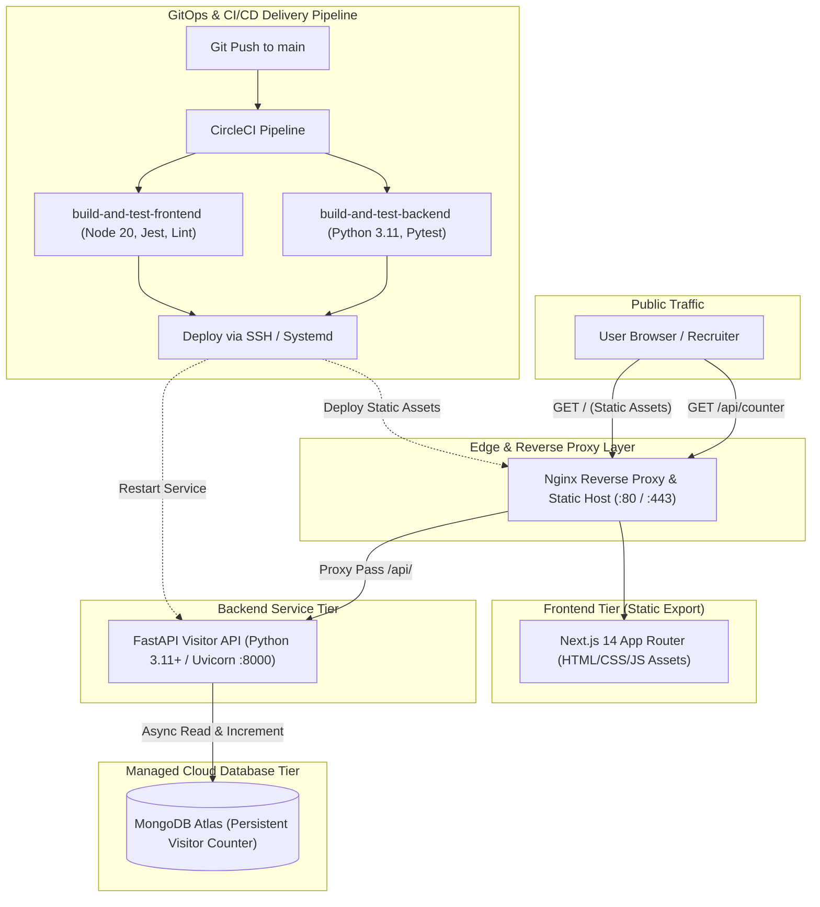

# Cloud Enoch — Cloud & DevOps Platform Portfolio

[](https://circleci.com/gh/cloudenochcsis/cloudresume)


The personal production portfolio and cloud engineering showcase of **Enoch .A**, Cloud & DevOps Engineer. Live at **[cloudenoch.com](https://cloudenoch.com)**.

This repository is itself a production-grade DevOps artifact—featuring a declarative **Next.js 14 App Router** static frontend, a high-performance **Python FastAPI** visitor analytics backend, automated **CircleCI** CI/CD pipelines with multi-tier test suites, and containerized deployment topologies.

---

## 🏛️ System Architecture



---

## 🛠️ Technology Stack

| Domain | Technology | Purpose |
| :--- | :--- | :--- |
| **Frontend Framework** | **Next.js 14 (App Router)** | Static site generation (`output: 'export'`) with optimal Core Web Vitals |
| **Language & UI** | **TypeScript & Tailwind CSS** | Type-safe UI components styled with terminal/infra-first theme |
| **Testing (Frontend)** | **Jest & React Testing Library** | Unit and integration testing across all 11 core UI components |
| **Backend API** | **FastAPI (Python 3.11+)** | High-performance asynchronous API for real-time visitor metrics |
| **Testing (Backend)** | **Pytest & Pytest-Cov** | Asynchronous endpoint test harness with mocked database drivers |
| **Database** | **MongoDB Atlas** | Managed NoSQL document store with atomic counter increments |
| **Containerization** | **Docker & Docker Compose** | Multi-stage Alpine builds (`node:20-alpine` → `nginx:alpine`) |
| **CI/CD & Automation** | **CircleCI & GitOps** | Automated linting, test suites, static build, and SSH droplet deployment |
| **Web Server & SSL** | **Nginx & Let's Encrypt** | Reverse proxy, static asset delivery, caching, and TLS termination |

---

## 📂 Repository Structure

The codebase is organized into modular, purpose-driven directories:

```
cloudresume/
├── .circleci/               # Continuous Integration & Delivery workflows
│   ├── config.yml           # CircleCI pipeline definition (test & deploy jobs)
│   ├── configure_nginx.sh   # Server-side Nginx provisioning script
│   └── resume-api.service   # Systemd service unit for FastAPI daemon
├── api/                     # Backend API service (Python FastAPI)
│   ├── main.py              # Application entrypoint & counter endpoints
│   ├── requirements.txt     # Pinned Python dependencies
│   ├── pytest.ini           # Pytest configuration
│   ├── Dockerfile           # Backend container specification
│   ├── .env.example         # Template for environment variables
│   └── test/                # Unit and integration test suite
│       ├── conftest.py      # Pytest fixtures and mocks
│       └── test_main.py     # Asynchronous API test cases
├── docs/                    # Architectural & project documentation
│   ├── architecture.md      # Detailed system architecture deep-dive
│   └── superpowers/         # Design specifications and implementation plans
│       ├── plans/
│       └── specs/
├── nginx/                   # Web server and reverse proxy configurations
│   ├── nginx.conf           # Base Nginx configuration
│   └── nginx.prod.conf      # Production SSL & caching Nginx config
├── public/                  # Static assets served at domain root
│   ├── favicon.ico
│   ├── manifest.json
│   └── robots.txt
├── scripts/                 # Server administration and bootstrapping scripts
│   └── setup-server.sh      # Ubuntu droplet initialization script
├── src/                     # Canonical Next.js Frontend Application
│   ├── app/                 # Next.js 14 App Router
│   │   ├── globals.css      # Tailwind base and utility classes
│   │   ├── layout.tsx       # Root layout, fonts, and metadata
│   │   └── page.tsx         # Root portfolio composition page
│   ├── components/          # Production UI components
│   │   ├── Hero.tsx         # Hero narrative, status pill & verified cert badges
│   │   ├── About.tsx        # Systems background & Academic Credentials (MS & BSc)
│   │   ├── FeaturedProject.tsx # Centerpiece GitOps Kubernetes architecture
│   │   ├── SkillsGrid.tsx   # Categorized core infrastructure & tooling stack
│   │   ├── ExperienceTimeline.tsx # Career arc (Crowdbotics lead, support foundation)
│   │   ├── Certifications.tsx # Verifiable AWS, Terraform, and Azure credentials
│   │   ├── BlogPreview.tsx  # Hashnode publications & engineering guides
│   │   ├── Footer.tsx       # Direct mail CTA, selectable email & socials
│   │   ├── Navigation.tsx   # Sticky brand header & section scroll navigation
│   │   ├── VisitorCounter.tsx # Live API visitor counter widget
│   │   ├── GitOpsDiagram.tsx # Interactive terminal pipeline visualization
│   │   ├── icons/           # Self-contained SVG icon system
│   │   └── __tests__/       # Comprehensive Jest test suites for all components
│   ├── content/             # Technical publication MDX source files
│   │   └── posts/
│   ├── data/                # Single source of truth data models
│   │   └── portfolioData.ts # Typed profile, certs, projects, and career data
│   └── hooks/               # Custom React hooks (scroll reveals, etc.)
├── docker-compose.yml       # Local multi-container development environment
├── Dockerfile               # Production multi-stage build (Node 20 -> Nginx)
├── next.config.mjs          # Next.js static export configuration
├── package.json             # Pinned frontend dependencies and scripts
├── tailwind.config.js       # Custom terminal color palette and typography
├── tsconfig.json            # Strict TypeScript configuration with @/* path alias
├── DEPLOYMENT.md            # Production deployment runbook
└── README.md                # This file
```

---

## 🚀 Quickstart & Local Development

### Prerequisites
- **Node.js**: `v20.x` (LTS recommended)
- **Yarn**: `v1.22+`
- **Python**: `3.11+`
- **Docker & Docker Compose** (optional, for containerized run)

### 1. Frontend Development

```bash
# Clone the repository
git clone https://github.com/cloudenochcsis/cloudresume.git
cd cloudresume

# Install dependencies
yarn install

# Run frontend in development mode
yarn dev
# Available at http://localhost:3000

# Run frontend unit tests
yarn test

# Run ESLint validation
yarn run eslint .

# Build static production export
yarn build
# Generates static assets in ./out and ./build
```

### 2. Backend Development

```bash
cd api

# Create and activate a Python virtual environment
python3 -m venv venv
source venv/bin/activate

# Install dependencies
pip install -r requirements.txt
pip install pytest pytest-cov

# Run backend tests
pytest

# Start the API server locally
uvicorn main:app --reload --port 8000
# Available at http://localhost:8000 (Docs at http://localhost:8000/docs)
```

### 3. Fullstack with Docker Compose

Run both the frontend and backend with a single command:

```bash
docker-compose up --build
```

- **Frontend**: `http://localhost:80`
- **API**: `http://localhost:8000`
- **API Health**: `http://localhost:8000/health`

---

## 🧪 Testing & Quality Gates

Every pull request must pass strict quality gates in CircleCI:

```bash
# Frontend validation
yarn run eslint .                        # Static code analysis
yarn test --passWithNoTests              # 13 test suites, 35 unit tests
yarn build                               # Next.js static compilation

# Backend validation
cd api && pytest                         # Asynchronous API test harness
```

---

## 🔒 Verified Credentials & Showcase

- **Live Website**: [https://cloudenoch.com](https://cloudenoch.com)
- **AWS Solutions Architect – Associate**: [Verify on Credly](https://www.credly.com/badges/193050a7-1625-4d8e-b77d-26d2fe8dd1e2/linked_in_profile)
- **HashiCorp Terraform Certified Associate**: [Verify on Credly](https://www.credly.com/badges/59645601-fc1c-42a8-b95b-4fbf3c499ef6/linked_in_profile)
- **Microsoft Azure Administrator**: [Verify on MS Learn](https://learn.microsoft.com/en-us/users/enochayivor-0815/credentials/f46a46b56d4133fb)
- **Open-Source Contributions**: [13 Merged PRs on OpenSRE](https://github.com/Tracer-Cloud/opensre/pulls?q=is%3Apr+is%3Amerged+author%3Acloudenochcsis)
- **Hashnode Technical Blog**: [cloudenoch.hashnode.dev](https://cloudenoch.hashnode.dev/)

---

## 📄 License

Distributed under the MIT License. See `LICENSE` for more information.
