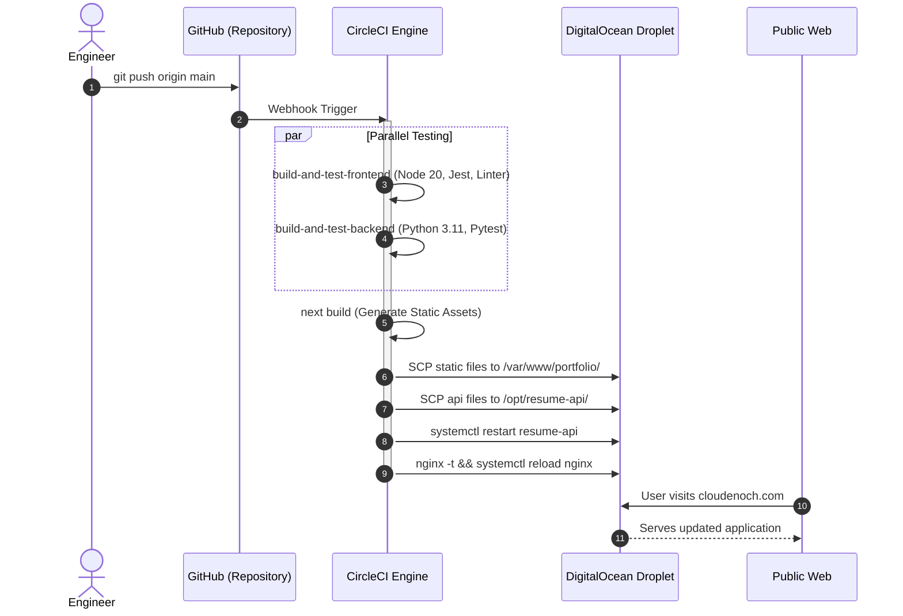

# Cloud Enoch — Architectural Deep-Dive & System Specifications

**Document Version:** 1.0.0  
**Target Environment:** Production ([cloudenoch.com](https://cloudenoch.com))  
**Engineering Discipline:** Cloud, DevOps & Platform Engineering  

---

## 1. High-Level Architecture

The Cloud Enoch platform follows a decoupled, resilient 3-tier architecture optimized for sub-second page loads, zero downtime deployments, and minimal maintenance overhead:

```
[ Public Web Traffic ]
          │
          ▼
┌─────────────────────────────────────────────────────────┐
│ Nginx Reverse Proxy & Static Host (:80 / :443)          │
│ - TLS 1.3 Termination (Let's Encrypt Certbot)          │
│ - Static Asset Cache Headers (1 Year Immutable JS/CSS)  │
│ - Rate Limiting & Gzip Compression                      │
└────────────┬───────────────────────────────┬────────────┘
             │                               │
    GET / (Static Content)         GET /api/* (Dynamic API)
             │                               │
             ▼                               ▼
┌─────────────────────────┐     ┌─────────────────────────┐
│ Next.js 14 Static Build │     │ FastAPI Backend Service │
│ (Pre-rendered HTML/JS)  │     │ (Python 3.11 / Uvicorn) │
│ Host: /var/www/portfolio│     │ Port: 8000 (Localhost)  │
└─────────────────────────┘     └────────────┬────────────┘
                                             │
                                     Async Read/Write
                                             │
                                             ▼
                                ┌─────────────────────────┐
                                │ MongoDB Atlas Cluster   │
                                │ (Visitor Metric Store)  │
                                └─────────────────────────┘
```

---

## 2. Frontend Engineering (Next.js 14 Static Export)

### Design Philosophy
- **Zero Server Overhead**: The frontend is completely pre-rendered at compile time using `output: 'export'` in `next.config.mjs`.
- **Global Availability & Speed**: Static HTML, CSS chunks, and JavaScript bundles are directly servable by Nginx or CDN edge networks (CloudFront/Cloudflare) with immediate Time-To-First-Byte (TTFB).
- **Type Safety**: Strictly typed models in `src/data/portfolioData.ts` ensure single-source-of-truth consistency across all components.

### Directory Organization
- `src/app/`: Next.js 14 App Router layout, page entry, and global Tailwind styles.
- `src/components/`: Self-contained, accessible React components designed with an infrastructure/terminal aesthetic (950 terminal black, electric blue accents).
- `src/data/`: Domain data structures (`personalInfo`, `certifications`, `featuredProject`, `skillCategories`, `experienceData`, `educationData`).
- `src/content/`: Technical markdown and MDX publications.

---

## 3. Backend Service (`api/`)

### Architecture
- **Framework**: FastAPI (asynchronous ASGI framework powered by Starlette & Pydantic).
- **Runtime**: Python 3.11+ running under Uvicorn worker process.
- **Process Management**: Managed via Linux `systemd` daemon (`resume-api.service`) with auto-restart on failure.
- **Database Driver**: Motor / AsyncIOMotorClient for non-blocking I/O operations against MongoDB Atlas.

### Endpoints
- `GET /health`: Health check probe endpoint for container or load balancer liveness tests.
- `GET /api/counter`: Atomically increments and returns total visitor counter metric:
  ```json
  {
    "count": 1420
  }
  ```

---

## 4. GitOps CI/CD Delivery Pipeline


